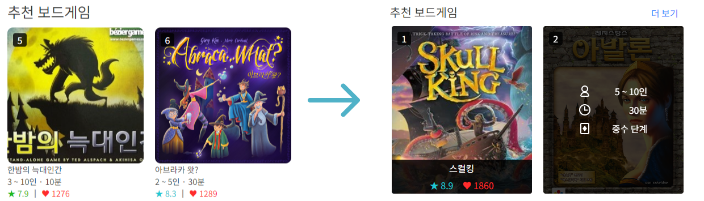
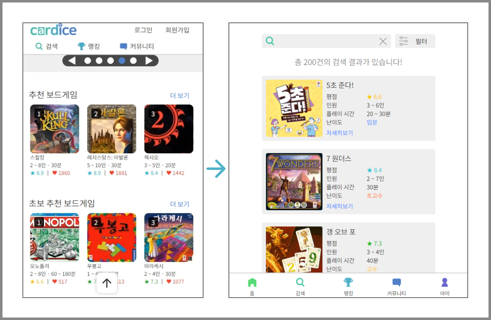

### API 서버 Github 링크

https://github.com/sataverse/cardice-api-server


### 실행방법

```
npm install
npm start
http://127.0.0.1:3000/
```

### 로그인
```
email : skullking@gmail.com
password : 0000
```
API 서버와 아직 연결되지 않아 임시 구현하였습니다.


### 업데이트 내용

---

#### 2024-03-20

- 카드의 디자인이 변경되었습니다.
- onMouseOver 이벤트가 보드게임의 추가 정보를 보여주도록 변경되었습니다.
- Slider와 Grid에서 한 라인당 카드의 최소 개수가 2개로 변경되었습니다.

---

#### 2024-03-21

- 작은 화면에서의 네비게이션 바의 디자인이 개선되었습니다.

---

#### 2024-03-26
- 사용자 페이지가 임시로 추가되었습니다.

---
