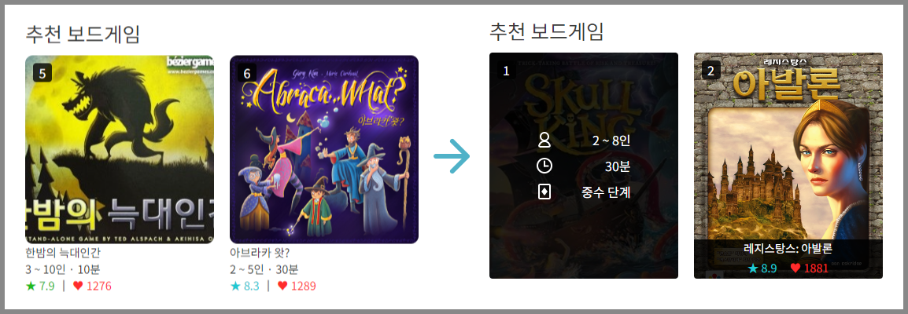

### API 서버 Github 링크

https://github.com/sataverse/cardice-api-server


### 실행방법

```
npm install
npm start
http://127.0.0.1:3000/
```

### 로그인
```
email : skullking@cardice.com
password : 0000
```


### 업데이트 내용

---

#### 2024-03-20

- 카드의 디자인이 변경되었습니다.
- onMouseOver 이벤트가 보드게임의 추가 정보를 보여주도록 변경되었습니다.
- Slider와 Grid에서 한 라인당 카드의 최소 개수가 2개로 변경되었습니다.

---

#### 2024-03-21

- 작은 화면에서의 네비게이션 바의 디자인이 개선되었습니다.

---

#### 2024-03-26
- 사용자 페이지가 임시로 추가되었습니다.

---

#### 2024-04-23
- API 서버와 연결되었습니다.
    - 이제 보드게임 데이터, 리뷰 데이터, 사용자 데이터를 API 서버에 요청합니다. 
    - 로그인/회원가입, 보드게임 및 리뷰에 좋아요 누르기, 리뷰 추가/삭제/수정 기능이 추가되었습니다.
- 데이터 로딩 과정에서 스켈레톤 UI가 적용됩니다.
- 보드게임 상세 정보 박스의 디자인이 변경되었습니다.
- 도넛차트에 애니메이션이 추가되었습니다.
- 검색 필터 정보가 페이지를 이동해도 초기화되지 않게 변경됩니다.
- Not Found Page가 추가되었습니다.

---